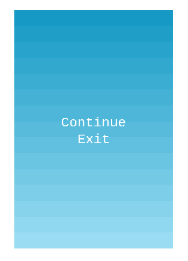

# flappy-bird-clone

### Goals
1. Playing around creating web games using JS and Phaser 3,
2. Learning new tools such as PhaserEditor2D,
3. Exploring a new programming language and the way of application development.

### Architecture

### Screenshots

### Overview
Flappy Bird is an arcade-style game in which the player controls the bird Faby, which moves persistently to the right. The player is tasked with navigating Faby through pairs of pipes that have equally sized gaps placed at random heights.

source: [wikipedia](https://en.wikipedia.org/wiki/Flappy_Bird#:~:text=Flappy%20Bird%20is%20an%20arcade,gaps%20placed%20at%20random%20heights.)

### Requirements

1. [node.js](https://nodejs.org/en) (recommended version is: v14.15.1)
2. [npm](https://www.npmjs.com/) (I'm using version: 6.14.8)
3. [git](https://git-scm.com/) (I'm using vesion 2.34.1)
4. optionally you can install the [Visual Studio Code](https://code.visualstudio.com/) to move around the code - I used it to write this application.

### How to run the application on localhost:8080

1. install required tools above (if needed), 
2. clone this repo into a folder of your choice on the local machine,
3. open a terminal and go to the folder you cloned the repo,
    - run a command `killall -9 node`, to make sure all node processes are killed,
    - run a command: `npm run dev`
4. go to [localhost](https://localhost:8080)
5. enjoy your time and play the game by pressing on the 'Play' button.

### Additional option: Open the application in the [PhaserEditor2D](https://phasereditor2d.com/downloads/)
##### For linux users:
1. download [PhaserEditor2D](https://phasereditor2d.com/downloads/) if needed,
2. unzip the downloaded file do directory of your choicew,
3. install [PhaserEditor2D v3 Launcher](https://www.npmjs.com/package/phasereditor2d-launcher),
    - run a command `npm install -g phasereditor2d-launcher`,
4. run command: `npx phasereditor2d-launcher -project path/to/project`,
5. PhaserEditor2d should opens in the web browser.

### What I have learned?
1. This project was a chance for me to explore JavaScript and the Phaser framework,
2. I could compare JS to other languages I'm using every day - Java and Groovy, and I used some time ago - Kotlin,
3. I noticed many common points to the Android application development, for instance lifecycle of the 'activities' (scenes), and also the flow of the application from starting the game to clicking the 'Exit' button when done,
4. I also had an opportunity to use a powerful tool - Linux. 
    - Through CLI, I was able to play with node.js, nvm, npm, scripting, and so on. This made my learning more efficient and also a little bit fancy,
5. I could spend some time exploring new features around web game development, by watching some additional videos and reading some articles, 
6. And last but not least, I had fun doing this.

